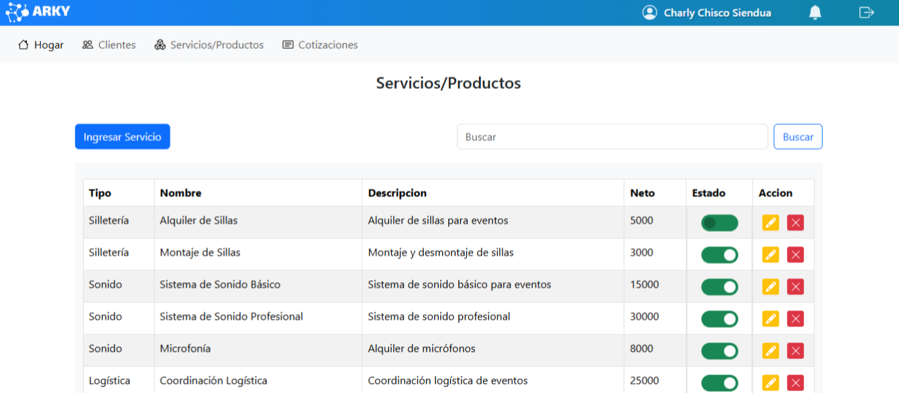
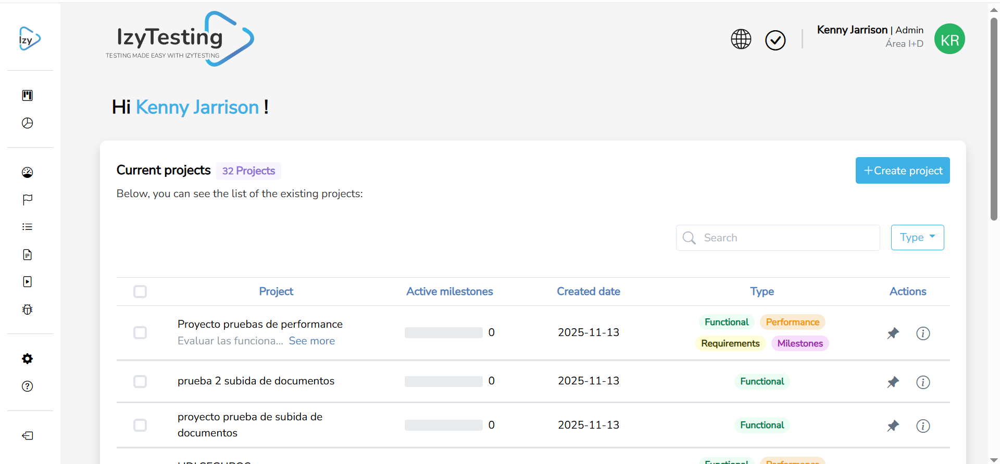

<!-- Banner superior -->

### 👋 ¡Hola! Soy 
💻 Desarrollador Full Stack Junior enfocado en construir software limpio, escalable y con propósito.  
✨ Me apasiona unir lo mejor del backend (Django, Spring Boot) con el frontend (Angular) para crear experiencias eficientes y elegantes.

---

### 🧭 Sobre mí

💼 Actualmente soy Desarrollador Full Stack Junior en QVision Technologies. 
🎯 Trabajo en módulos internos, automatizaciones y funcionalidades para sistemas de gestión de proyectos. 
🚀 Me gustan las arquitecturas limpias, las buenas prácticas y optimizar procesos dentro del flujo de desarrollo. 
📚 Siempre aprendiendo algo nuevo y fortaleciendo mis habilidades en desarrollo full stack.

---

### 🧠 Tecnologías

<!-- Lenguajes -->
  
  

<!-- Frameworks -->
  
  

<!-- Frontend -->
  
  

<!-- Bases de datos -->
  

<!-- Herramientas -->
  
  
  
  
  

---

### 🌟 Proyectos Destacados
<table>
<tr>

<!-- ARKY -->
<td width="40%" style="padding: 5px;">

<h3 align="center">📌 ARKY Cotizaciones</h3>

<strong>Sistema para gestionar cotizaciones de manera rápida y organizada.</strong>

<b>Tecnologías:</b> 

  

</td>

<!-- IZY TESTING -->
<td width="40%" style="padding: 10px;">

<h3 align="center">🧪 Izy Testing</h3>

<strong>Plataforma de automatización de pruebas con IA y agentes inteligentes.</strong>

<b>Tecnologías:</b> 

  

</td>

</tr>
</table>
---

### 📊 Estadísticas

 
   
  
   

---
